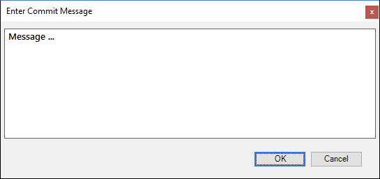

## Cake.Dialog

Show input dialog



## Support

- [x] Windows
- [ ] macOS
- [ ] Linux

## Sample

```csharp
#addin "nuget:?package=Cake.Dialog"

Task("Show-Input-Dialog").Does(() => {
    InputDialog(options => {
        options.Title = "Enter commit message";
        options.Text = "Update ...";
        options.OnOk = (text) => {
            Console.WriteLine(text);
        };
    });
});
```